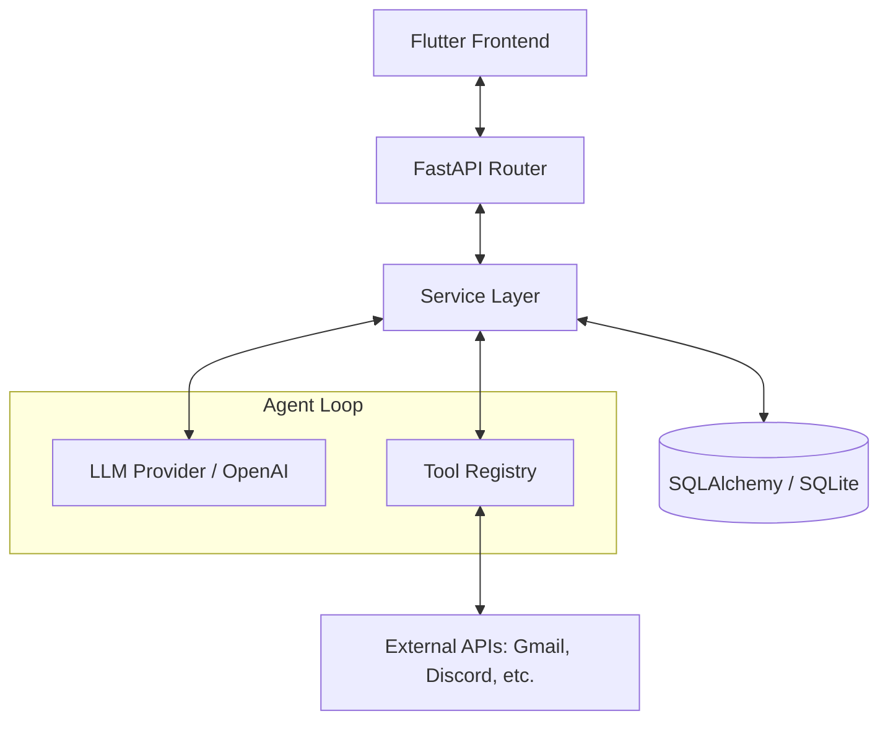

# Backend Architecture

The Weaver backend is a high-performance, asynchronous Python application designed to manage tool execution, orchestrate multi-agent workflows, and provide a secure API for the frontend.

## Tech Stack

- **Framework**: [FastAPI](https://fastapi.tiangolo.com/) - High-performance web framework for building APIs with Python 3.10+.
- **Database**: [SQLAlchemy](https://www.sqlalchemy.org/) with [aiosqlite](https://github.com/omnilib/aiosqlite) (Local Dev) or [PostgreSQL](https://www.postgresql.org/) (Production).
- **Migrations**: [Alembic](https://alembic.sqlalchemy.org/) for database schema management.
- **Validation**: [Pydantic](https://docs.pydantic.dev/) for data modeling and request/response validation.
- **Agent Orchestration**: [LangGraph](https://langchain-ai.github.io/langgraph/) and [LangChain](https://python.langchain.com/) for tool-aware agent flows.
- **Authentication**: [Authlib](https://docs.authlib.org/) and [python-jose](https://python-jose.readthedocs.io/) for OAuth2 and JWT handling.
- **Logging & Tracing**: [structlog](https://www.structlog.org/) for structured logging and [OpenTelemetry](https://opentelemetry.io/) for distributed tracing.

---

## High-Level Component Diagram

---

## Core Concepts

### 1. The Service Layer
All business logic resides in `app/services/`. This layer abstracts the complexity of LLM interactions, tool registration, and database operations.
- **LLM Service**: Handles communication with AI models.
- **Tool Service**: Manages the registry of available tools (both native and external).
- **Integration Services**: Specific logic for Gmail, Google Drive, and Discord.

### 2. Tool-Aware Agents
Weaver uses LangGraph to create stateful, multi-turn agent conversations. The agent can "decide" to call tools based on the user's intent.
- **Native Tools**: Filesystem operations, system commands.
- **External Tools**: OAuth-authenticated APIs like Gmail and Discord.

### 3. Data Contracts (Schemas)
All data entering or leaving the API is validated using Pydantic schemas. This ensures type safety and provides automatic documentation via Swagger UI.

### 4. Background Workers
For long-running tasks or scheduled automations, Weaver uses a task queue (ready for expansion with `arq` or Redis).

---

## Request Flow

1.  **Frontend** sends an HTTP request to an endpoint (e.g., `/api/v1/chat/agent`).
2.  **FastAPI** validates the request body against a Pydantic schema.
3.  **Router** calls the appropriate service method.
4.  **Service Layer** interacts with the database or invokes an agent loop.
5.  **Agent** decides if tools are needed, executes them, and gathers results.
6.  **Service** returns the final response to the Router.
7.  **FastAPI** serializes the response back to JSON for the Frontend.
