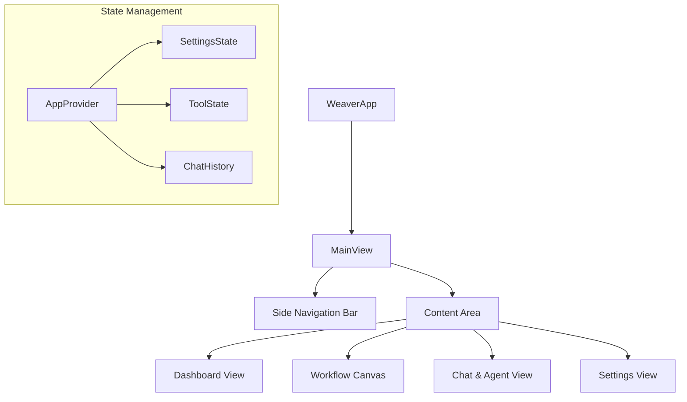

# Frontend Architecture

The Weaver frontend is a high-fidelity Flutter desktop application designed for power users of AI agents and automations. It follows a clean, modular architecture centered around **Provider** for state management and a "tool-card-first" design philosophy.

## Tech Stack

- **Framework**: [Flutter](https://flutter.dev/) - UI toolkit for building natively compiled applications for desktop from a single codebase.
- **State Management**: [Provider](https://pub.dev/packages/provider) - A wrapper around InheritedWidget to make state management more accessible and reusable.
- **Networking**: [http](https://pub.dev/packages/http) for REST API calls and [web_socket_channel](https://pub.dev/packages/web_socket_channel) for real-time trace events.
- **Styling**: [Google Fonts](https://pub.dev/packages/google_fonts) (Inter/Outfit) and [Vanilla CSS-like concepts](https://pub.dev/packages/gap) for spacing.
- **Animations**: [flutter_animate](https://pub.dev/packages/flutter_animate) for smooth micro-interactions.
- **Markdown**: [flutter_markdown](https://pub.dev/packages/flutter_markdown) for rendering rich text responses from the AI.

---

## High-Level UI Structure

---

## Core Concepts

### 1. The Provider Layer
The application's global state is managed in `lib/providers/`. This includes:
- **Settings**: Backend URL, API keys, and theme preferences.
- **Tool Catalog**: The list of available tools fetched from the backend.
- **Chat State**: Managing the history of messages and tool execution traces.

### 2. View-Widget Pattern
Each main screen (in `lib/screens/`) is decomposed into reusable widgets (in `lib/widgets/`).
- **Views**: High-level layouts for Dashboard, Workflows, etc.
- **Widgets**: Atomic elements like `ToolCard`, `ChatMessage`, or `ControlPanel`.

### 3. Service Layer
The `lib/services/` directory contains classes for interacting with external systems.
- **BackendService**: Encapsulates all HTTP calls to the Python backend.
- **Persistence**: Handles saving settings to local storage (`shared_preferences`).

---

## Data Flow (Chat Example)

1.  **User** types a prompt in `ChatInput` widget.
2.  **Widget** calls `AppProvider.sendPrompt()`.
3.  **Provider** sets `isLoading = true` and notifies listeners (triggering UI loaders).
4.  **Provider** calls `BackendService.postAgentPrompt()`.
5.  **BackendService** sends the HTTP request and waits for the response.
6.  **Backend** returns the LLM response and tool execution data.
7.  **Provider** updates the `chatHistory`, sets `isLoading = false`, and notifies listeners.
8.  **UI** automatically re-renders with the new message and tool results.

---

## Responsive Design
While primarily a desktop app, Weaver uses `LayoutBuilder` and flexible widgets to ensure it looks great at various window sizes.

## Key References
- [Flutter Architectural Overview](https://docs.flutter.dev/resources/architectural-overview)
- [Simple App State Management (Provider)](https://docs.flutter.dev/development/data-and-backend/state-mgmt/simple)
