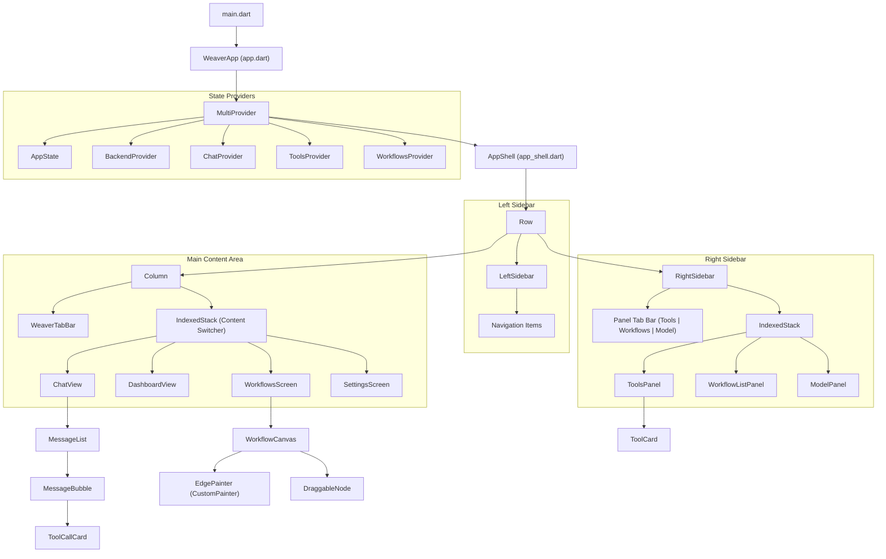

# Weaver Widget Hierarchy

This document maps the structural hierarchy of the Weaver Flutter application, showing how the main components are nested and how the application is orchestrated.

## Overview Flowchart

The following diagram illustrates the relationship between the entrypoint, the state providers, and the primary UI components.

## Component Descriptions

### Root Layer
- **WeaverApp**: The entrypoint that initializes the `MaterialApp` and wraps the entire application in a `MultiProvider` to inject global state.
- **AppShell**: The master layout widget that defines the three-pane architecture (Left Sidebar, Main Content, Right Sidebar).

### Main Views
- **ChatView**: The primary interaction interface. It uses a `ListView.builder` for messages and renders specialized "Tool Call Cards" when the agent executes functions.
- **DashboardView**: A high-level overview screen using `fl_chart` for data visualization.
- **WorkflowsScreen**: Houses the `WorkflowCanvas` where users can build automation logic.
- **SettingsScreen**: Manages backend connection details and user preferences.

### Specialized Components
- **WorkflowCanvas**: A complex interactive canvas that uses `CustomPainter` for drawing Bezier curves and `GestureDetector` for node dragging and zooming.
- **ToolCard**: A reusable component for inspecting, configuring, and authenticating individual tools (Gmail, Discord, etc.).
- **MessageBubble**: A context-aware component that switches layout between `UserBubble` and `AssistantBubble` based on the message role.
